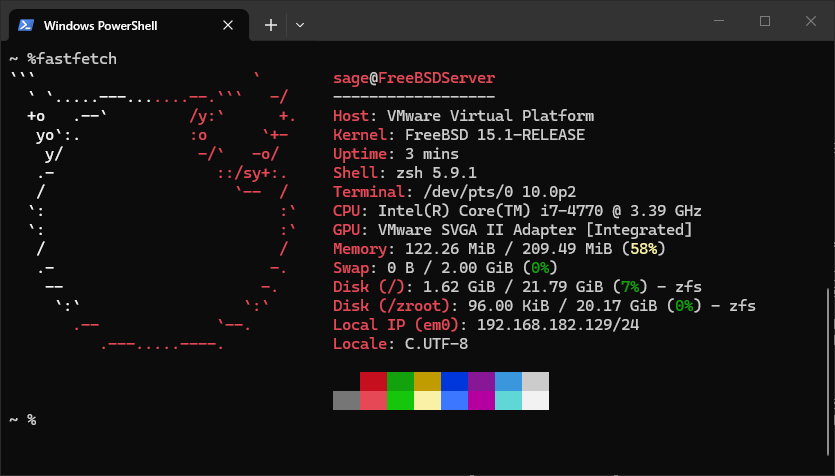

# BSD Sockets - Client and Server Programs
I wrote the server for the FreeBSD virtual machine to learn about BSD socket programming and networking with FreeBSD.

## Why I wrote the Asynchronous Version of the Server?
The reason I wrote the asynchronous version of the server because the synchronous version sucks on Windows. On Windows, you can't easily exit out of the synchronus version of the server when typing Ctrl-C because the function socket.accept() blocks the program. You exit the synchronous version of the server when you type Ctrl-C on the server and then you send a client request to the server. You can also exit the synchronous version of the server by typing Ctrl-Pause but having to type that everytime is horrible.